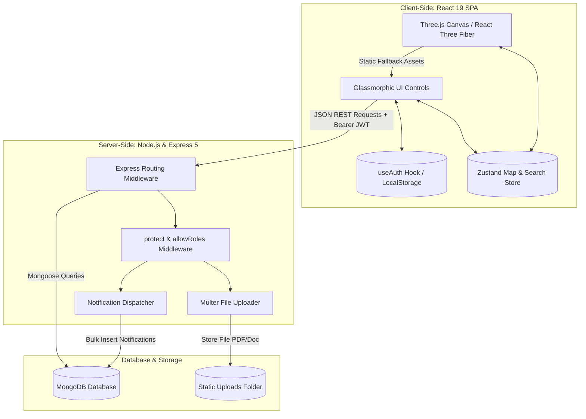

# Project Walkthrough: Campus Guide

Campus Guide is a full-stack, spatial-academic resource discovery platform. It merges centralized academic file sharing with interactive 3D WebGL-based wayfinding, allowing students and faculty to access academic resources and navigate to their physical campus locations through a unified, role-governed web application.

---

## 1. Project Overview & Architecture

### Problem Statement
Traditional university portals store academic materials (such as syllabi, lab guides, and references) in siloed directories decoupled from physical locations. For new students, visitors, or faculty, navigating a large campus to find these resources (e.g., a physical manual in a specific lab or block) creates visual and cognitive friction. Furthermore, access to these systems is often poorly guarded, lacking role-aware access controls.

### Objectives
1. **Centralize Academic Resources**: Provide a unified platform to search, download, and bookmark files by title, subject, or location.
2. **Interactive 3D Wayfinding**: Render a low-poly 3D representation of the campus grounds directly in the web browser.
3. **Automated Road Routing**: Compute and animate paths connecting campus locations.
4. **Role-Based Access Control (RBAC)**: Segregate actions based on user profiles:
   * **Guest**: Restricted to map visual browsing.
   * **Student**: Allowed to search, download, and bookmark.
   * **Professor**: Allowed to upload files and view upload history.
   * **Admin**: Complete system dashboard control (CRUD operations on users, buildings, and files).
5. **Auditing & Notification Broadcaster**: Track operations (downloads, uploads, map adjustments) and alert users in real time.

---

## 2. System Architecture & Data Flow



### Complete End-to-End Data Flow

#### A. User Registration & Login Flow
1. The user registers via `/signup`, selecting a role (`student` or `professor`). The backend hashes the password using **bcryptjs** and stores it in the `User` collection.
2. During login at `/login`, the user enters credentials. For administrators, an `adminSecretKey` is verified against server environment variables.
3. Upon validation, the server generates a JSON Web Token (JWT) containing the user’s ID, email, and normalized role.
4. The client saves this token in `localStorage` as `userInfo`. The `useAuth` hook registers this change and updates the reactive app state.

#### B. Resource Search & Download Flow
1. The authenticated user inputs a query in the **Search** tab.
2. The client triggers a request to `GET /api/resources?search={query}` with the JWT in the `Authorization: Bearer <token>` header.
3. The server uses the `protect` middleware to verify the JWT and the `allowRoles('student', 'professor')` middleware to authorize access.
4. The database is queried using Mongoose regex filters:
   ```javascript
   query = {
     $or: [
       { title:    { $regex: search, $options: 'i' } },
       { subject:  { $regex: search, $options: 'i' } },
       { location: { $regex: search, $options: 'i' } }
     ]
   };
   ```
5. The matching documents are returned. If a user downloads a file via `GET /api/resources/download/:id`, the server:
   * Verifies the file's database entry.
   * Creates a tracking log in the `Download` collection.
   * Returns a JSON authorization payload containing the static file URL (`/uploads/filename.pdf`).
   * The client initiates the browser download prompt.

#### C. Interactive 3D Wayfinding & Pathfinding Flow
1. The client selects a starting building and a destination building from the **Campus Navigator** panel.
2. The destination building type is mapped to a database location category (e.g., `LabA` mapped to `Lab`).
3. An API request is sent to `GET /api/resources?search=Lab` to retrieve matching resources.
4. Concurrently, the pathfinder executes a **Breadth-First Search (BFS)** algorithm on the client-side road network graph:
   * Map coordinates are loaded from `useMapStore`.
   * The algorithm resolves starting/ending buildings to nearest driveway nodes.
   * BFS yields the shortest sequence of road intersection waypoints.
5. The list of resolved points is interpolated into a sequence of points defining a smooth 3D Catmull-Rom spline curve.
6. The `PathLine` component renders a glowing dashed line that flows along the curve, with directional arrow cones pointing toward the destination.
7. The destination building glows cyan. Clicking it brings up a side panel with the resources retrieved in step 3.

---

## 3. Technology Stack & Rationale

| Layer | Technology | Rationale |
|---|---|---|
| **Frontend** | React 19 | Declarative UI rendering, concurrent rendering features, component-driven design. |
| **Build Tool** | Vite | Lightning-fast Hot Module Replacement (HMR) and optimized rollup production bundles. |
| **3D Rendering** | React Three Fiber (R3F) & @react-three/drei | Declarative Three.js wrapper. Links 3D canvas objects to React state, enabling WebGL rendering with reactive hover, selection, and click events. |
| **Styling** | Tailwind CSS & Framer Motion | Tailwind provides utility-first layout styling. Framer Motion powers micro-interactions, spring animations, and tab transitions. |
| **State Management**| Zustand | Lightweight, hook-based state container. Avoids complex Redux boilerplate, allowing out-of-render-loop updates crucial for 3D render cycles. |
| **Backend** | Node.js & Express 5 | High-throughput asynchronous request processing. Express 5 natively supports promise rejection routing. |
| **Database** | MongoDB & Mongoose | Flexible document schema. Allows building configurations to use mixed object structures and index relationships efficiently. |
| **Security & Auth** | JWT, bcryptjs & Multer | Bcryptjs hashes passwords with a work factor of 10. Multer parses multipart forms, enforcing a 25MB limit on PDF uploads. |

---

## 4. Database Schema Design

The data models use Mongoose schemas with indexes to enforce relationships and optimize queries:

### User Collection (`User`)
* **name**: `String` (trimmed).
* **email**: `String` (unique, indexed, normalized lowercase).
* **password**: `String` (hashed via bcryptjs).
* **role**: `String` (enum: `student`, `professor`, `guest`, `admin`).
* **isBlocked**: `Boolean` (defaults to `false`).
* *Timestamps enabled*.

### Resource Collection (`Resource`)
* **title**: `String` (required).
* **subject**: `String` (required).
* **location**: `String` (enum: `Library`, `Lab`, `Classroom`).
* **fileUrl**: `String` (required, path to static file).
* **uploadedBy**: `ObjectId` (references `User`).
* **status**: `String` (enum: `approved`, `rejected`, `pending`; defaults to `approved`).
* *Timestamps enabled*.

### Building Collection (`Building`)
* **key**: `String` (unique key, e.g., `Library`, `LabA`).
* **id**: `String` (human-readable ID).
* **label**: `String` (display name).
* **type**: `String` (type indicator, e.g., `library`, `lab`, `classroom`).
* **position**: `[Number]` (array of 3 numbers: `[x, y, z]`).
* **buildingType**: `String` (visual style: `block`, `tower`, `layered`, `industrial`, `dome`, `playground`).
* **buildingProps**: `Mixed` (dimensions, heights, canopy radius).
* *Timestamps enabled*.

### Notification Collection (`Notification`)
* **userId**: `ObjectId` (references `User`, indexed for rapid retrieval).
* **message**: `String` (required).
* **type**: `String` (enum: `resource`, `building`, `warning`, `info`).
* **isRead**: `Boolean` (defaults to `false`, indexed).
* *Timestamps enabled*.

### Supporting Activity Collections (`Download`, `Bookmark`, `Upload`)
* **Download**: Logs `user`, `resource` reference, `resourceName`, and `downloadedAt`.
* **Bookmark**: Stores `user`, `resource` references, resource copy metadata, and includes a compound unique index on `{ user: 1, resource: 1 }` to prevent duplicates.
* **Upload**: Logs uploaded files and statuses for professors.

---

## 5. Directory Structure

```
CAMPUS-GUIDE/
├── backend/                  # RESTful Node API
│   ├── .env                  # Port, MongoDB connection strings, keys
│   ├── index.js              # Server boot, DB connect, default Admin seeding
│   ├── middleware/
│   │   └── authMiddleware.js # JWT validation & allowRoles authorization guard
│   ├── models/               # Mongoose Schemas (User, Resource, Building, etc.)
│   ├── routes/               # Express routing (auth, admin, resource, notifications)
│   ├── services/
│   │   └── notificationService.js # Helper functions for bulk notification inserts
│   └── uploads/              # Local storage folder for Multer file uploads
├── frontend/                 # Vite & React Frontend Application
│   ├── public/               # Static public assets and icons
│   ├── src/                  # Application source code
│   │   ├── main.jsx          # App mounting point, ToastProvider, Router
│   │   ├── App.jsx           # Home Page layout and visual sections
│   │   ├── index.css         # Main styling, custom scrolls, scrollbar hiding
│   │   ├── store/
│   │   │   └── useMapStore.js# Zustand store (buildings catalog, navigator inputs)
│   │   ├── hooks/
│   │   │   └── useAuth.js    # Reactive Auth hook with cross-tab sync listener
│   │   ├── utils/
│   │   │   └── accessControl.js # Feature capability permission rules
│   │   ├── pages/            # Pages (Admin, Login, Signup, About, Profiles)
│   │   └── components/
│   │       ├── admin/        # Admin dashboard components and tables
│   │       ├── map/          # 3D canvas and R3F building/path elements
│   │       ├── sections/     # Home page layout sections (Hero, Navbar, Tabs)
│   │       └── ui/           # Auth Guards, Custom Buttons, Notification Bell
│   ├── index.html            # SPA HTML mount page
│   ├── vite.config.js        # Vite configurations
│   ├── tailwind.config.js    # Tailwind styling configuration
│   └── package.json          # Frontend dependencies & scripts
├── package.json              # Root workspace task runner
└── walkthrough.md            # Architecture & system documentation
```

---

## 6. Key Algorithms & Implementation Logic

### A. Road Waypoint Graph and BFS Routing
To prevent routing lines from cutting through buildings, the system implements a waypoint routing system.

```
       [nw] ------------ [north] ------------ [ne]
        |                  |                   |
        |      (NW)        |       (NE)        |
      [west] ----[wm] --- [ctr] --- [em] ---- [east]
        |                  |                   |
        |      (SW)        |       (SE)        |
       [sw] ------------ [south] ----------- [se]
```

1. **Graph Definition**: The road network is represented as an adjacency list `ADJ` where intersections and road markers are nodes (e.g., `ctr` at `[0, 0]`, `wm` at `[-5.5, 0]`) and road segments are edges.
2. **Driveway Connections**: Each building maps to entry waypoints (e.g., `Library` connects to `wm` or `nm`).
3. **BFS Routing**: When a route from building `A` to building `B` is requested, the system computes the shortest path between their entrance points using a Breadth-First Search (BFS) algorithm:
   ```javascript
   function bfs(startId, goalId) {
     if (startId === goalId) return [startId];
     const visited = new Set([startId]);
     const queue = [[startId]];
     while (queue.length) {
       const path = queue.shift();
       const current = path.at(-1);
       for (const neighbor of ADJ[current]) {
         if (visited.has(neighbor)) continue;
         const nextPath = [...path, neighbor];
         if (neighbor === goalId) return nextPath;
         visited.add(neighbor);
         queue.push(nextPath);
       }
     }
     return [startId, goalId];
   }
   ```
4. **Waypoints to Curve Spline**: The array of shortest waypoints is converted into 3D points (`THREE.Vector3`). The array is processed by a Catmull-Rom spline generator (`CatmullRomCurve3`), which outputs a smooth curved path of 60 to 120 points.
5. **Directional Arrow Animation**: In `PathLine.jsx`, arrow cones are placed at regular intervals along the spline and oriented to face the direction of the path using the angle of the segment tangent:
   ```javascript
   const dir = new THREE.Vector3().subVectors(nextPt, prevPt).normalize();
   const angle = Math.atan2(dir.x, dir.z);
   ```
   The dashed offset is decremented on every frame using `clock.getElapsedTime()` inside `useFrame`, creating a flowing animation effect.

### B. Building Hover Animation LERP
To make building interactions feel responsive, the 3D meshes scale up when hovered. The scaling is smoothed using Linear Interpolation (LERP):
```javascript
useFrame((state, delta) => {
  if (!groupRef.current) return;
  const targetScale = (isHighlighted || isStart || isDestination) ? 1.08 : 1.00;
  groupRef.current.scale.y = THREE.MathUtils.lerp(
    groupRef.current.scale.y,
    targetScale,
    delta * 7
  );
});
```

---

## 7. Performance Optimizations & Security

### Performance Optimizations
1. **Low-Poly Models**: 3D geometries are composed of basic shapes (cubes, cylinders, spheres) to minimize GPU vertex draw calls.
2. **Component Memoization**: React components inside the 3D scene (such as `CampusScene` and `Tree`) use `React.memo` to prevent re-renders when parent states change.
3. **Zustand State Isolation**: Map interaction states (highlight, start, and end points) are stored in Zustand. This ensures that canvas updates occur independently of the main React DOM render tree, maintaining a consistent 60 FPS.
4. **Database Indexes**: Databases indexes are defined on `User.email` (unique), `Notification.userId`, and `Bookmark` compound properties (`{ user: 1, resource: 1 }`) to keep query response times low.

### Security Implementation
* **Password Security**: Passwords are encrypted in a Mongoose pre-save hook using **bcryptjs** (10 salt rounds).
* **Stateless JWT Authorization**: API routes are protected by JWT verification middleware.
* **Role Guards**: Middleware restricts access to administrative endpoints (`/api/admin/*`) and resource uploads (`/api/resources/upload`) to authorized roles.
* **Self-Action Prevention**: Admins are prevented from blocking or deleting their own accounts in the dashboard.
* **File Upload Restrictions**: Multer middleware enforces a maximum file size of 25MB to prevent storage exhaustion.

---

## 8. Technical Challenges & Solutions

### Challenge 1: Mongoose Hook Compatibility in Express 5
* **Issue**: Standard async `pre('save')` hooks containing `next()` calls caused request hanging or unhandled rejections under Express 5's router.
* **Solution**: Rewrote the pre-save password-hashing hook to return a promise without calling `next()`:
  ```javascript
  userSchema.pre('save', async function () {
    if (!this.isModified('password')) return;
    this.password = await bcrypt.hash(this.password, 10);
  });
  ```

### Challenge 2: Toast UI Crashes
* **Issue**: Toast components triggered inside auth pages threw context errors because `ToastProvider` was mounted at the child route level instead of wrapping the application root.
* **Solution**: Lifted `ToastProvider` to `main.jsx`, wrapping the global `<Routes>` component. This makes the toast system accessible from any page, route, or sub-component.

### Challenge 3: Z-Fighting on Road Renderings
* **Issue**: The grey road overlays and the green ground canvas shared the same vertical coordinate ($y=0$), causing rendering flickering (Z-fighting) as the camera moved.
* **Solution**: Raised all road geometry objects to a constant height of `RY = 0.025`, placing them just above the grass layer. The path line and start/end markers were set to `RY + 0.12` to prevent clipping.

---

## 9. Interviewer Q&A

### Module 1: System Design & API Services

#### Q: How is user authorization managed on the backend? Can you explain the custom middleware?
**A**: Authorization is managed using JWTs and role-based validation middleware. When a user requests a protected route, the request goes through the `protect` middleware first. This extracts the token from the `Authorization: Bearer <token>` header, decodes it using the server's `JWT_SECRET`, and queries the database for the user. 
The user profile is then appended to the request object (`req.user`), with their role normalized (e.g., converting "faculty" to "professor").
```javascript
const protect = async (req, res, next) => {
  const authHeader = req.headers.authorization;
  if (!authHeader || !authHeader.startsWith('Bearer ')) {
    return res.status(401).json({ message: 'Not authorized, token missing' });
  }
  const token = authHeader.split(' ')[1];
  try {
    const decoded = jwt.verify(token, process.env.JWT_SECRET);
    const user = await User.findById(decoded.userId).select('-password');
    if (!user) return res.status(401).json({ message: 'User not found' });
    req.user = { ...user.toObject(), role: normalizeRole(user.role) };
    next();
  } catch (error) {
    return res.status(401).json({ message: 'Token invalid' });
  }
};
```
To validate roles, we wrap routing handlers with the `allowRoles` middleware. This compares the normalized user role against the list of authorized roles:
```javascript
const allowRoles = (...roles) => {
  const allowed = roles.map(r => normalizeRole(r));
  return (req, res, next) => {
    if (!req.user || !allowed.includes(normalizeRole(req.user.role))) {
      return res.status(403).json({ message: 'Unauthorized' });
    }
    next();
  };
};
```

#### Q: How does the notification system work when a professor uploads a resource?
**A**: The notification system uses a decoupled database routine. When a professor uploads a file via `POST /api/resources/upload`, the resource is saved to the database. The route handler then triggers the notification routine:
1. Queries the database to retrieve the IDs of all registered student accounts:
   ```javascript
   const students = await User.find({ role: 'student' }).select('_id');
   const studentIds = students.map(s => s._id);
   ```
2. Passes these IDs to the notification service:
   ```javascript
   await createNotificationsForUsers({
     userIds: studentIds,
     message: `New resource uploaded – ${created.title}`,
     type: 'resource'
   });
   ```
3. The service maps the recipient array and inserts the notification documents in bulk using a single database operation:
   ```javascript
   Notification.insertMany(payload, { ordered: false });
   ```
4. A separate notification is created and saved for the uploading professor as confirmation.

---

### Module 2: 3D Visualization & Math

#### Q: How does the path finding system map building selections to road waypoints?
**A**: The 3D campus layout is built on a predefined grid, where main roads run along $x=0$ and $z=0$, and secondary roads run along $x=\pm9$ and $z=\pm9$. 
We define a waypoint network where nodes represent road intersections and midpoints, and edges represent road segments.
```javascript
const NODES = {
  nw: [-9, -9], ne: [9, -9],
  wm: [-5.5, 0], ctr: [0, 0], // ...
};
```
Each building profile is mapped to entrance nodes (its "driveways"). For example, the `Library` at `[-5.5, -5.5]` connects to the road system at nodes `wm` and `nm`.
When a route is requested:
1. The system retrieves the entrance nodes for both buildings.
2. It runs a Breadth-First Search (BFS) algorithm to find the shortest path between the entry nodes.
3. The resulting waypoints are converted to 3D coordinates.
4. These coordinates are used to draw a glowing path line that follows the campus road network rather than cutting through buildings.

#### Q: The route path is curved. How are those waypoints smoothed?
**A**: We use **Catmull-Rom Spline Interpolation** via Three.js. The waypoint sequence is passed to a `CatmullRomCurve3` instance:
```javascript
const curve = new THREE.CatmullRomCurve3(waypoints, false, 'catmullrom', 0.5);
const curvePts = curve.getPoints(n);
```
The constructor calculates intermediate coordinates along the path, producing a smooth curved line. The spline is then rendered using the `Line` component from `@react-three/drei`.

---

### Module 3: State Management & Component Design

#### Q: What was the rationale for choosing Zustand over Redux or React Context?
**A**: Renders in Three.js run inside a high-frequency loop (often 60 times per second). React Context updates can cause the entire component tree to re-render, which degrades canvas performance. Redux can introduce unnecessary rendering overhead due to its boilerplate code.
Zustand provides a lightweight store that allows components to select and subscribe to specific state slices. This keeps visual updates (such as hover states or path coordinates) isolated from the rest of the application layout, ensuring smooth rendering performance.
```javascript
const selectedBuilding = useMapStore(state => state.selectedBuilding);
```

#### Q: How does the application sync authentication state across multiple browser tabs?
**A**: The application uses a storage event listener in the `useAuth` hook. When a user logs in, logs out, or updates their profile in one tab, the browser triggers a storage event. The listener detects changes to the `userInfo` key and updates the component state across all open tabs:
```javascript
useEffect(() => {
  const onStorage = () => setUserState(getUser());
  window.addEventListener('storage', onStorage);
  return () => window.removeEventListener('storage', onStorage);
}, []);
```
This ensures that if a user logs out in one tab, all other tabs immediately update to restrict access.
